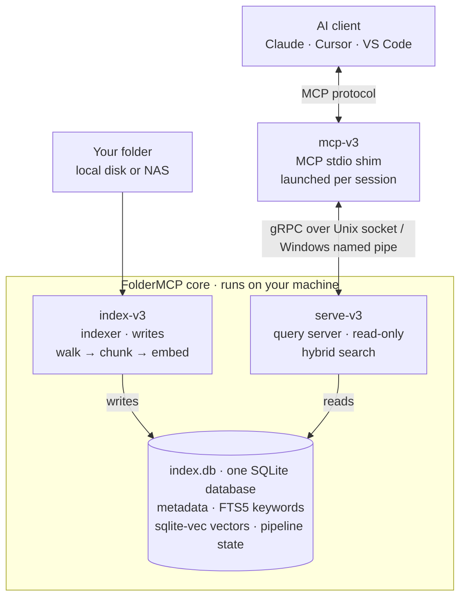
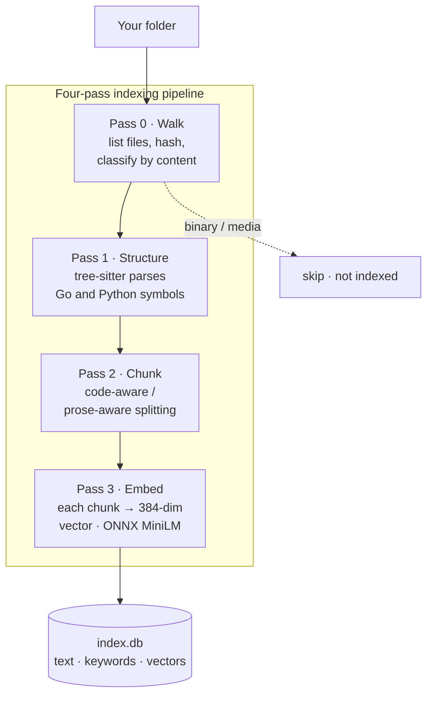
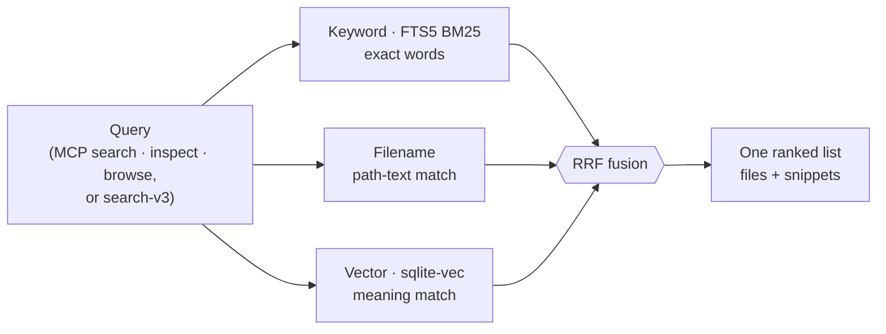

# FolderMCP

[](https://github.com/gtm-k/foldermcp/actions/workflows/ci.yml)
[](https://go.dev)
[](LICENSE)
[](https://modelcontextprotocol.io)

**Turn any folder into a private, local-first semantic index your AI assistant can search — nothing leaves your machine.**

Point FolderMCP at a folder of source code, Markdown, and text files. It reads them once,
builds a "search brain" in a **SQLite database on your own disk**, and serves it to AI tools
(Claude, Cursor, VS Code, …) through [MCP (Model Context Protocol)](https://modelcontextprotocol.io).
Your assistant can then find the right piece by **meaning**, not just keywords — even when the
folder lives on a shared network drive, and **without uploading a single byte to the cloud**.

> **Status — v3 is an early preview.** Today it does local semantic + keyword search over
> **source code and Markdown/text files**, built from source behind transitional `-v3` subcommands.
> Structured-data files (CSV/JSON/YAML), PDF/Office text, and images are **not indexed yet**, and
> there is no live file-watcher — all on the [roadmap](#roadmap) below. The original **v0.1.0 MCP
> tool server** — turning a folder of functions and scripts into callable MCP tools — remains
> available and is documented [further down](#v010--mcp-tool-server).

## How it works

FolderMCP is a **split-daemon** design: a heavy *indexer* that writes the index, and a fast,
read-only *query server* that answers searches. They never block each other, and they share one
SQLite database.



The indexer and query server are split so a long indexing run never blocks an interactive search,
and the query server can open the database read-only. Text, keyword index, and meaning-vectors all live in **one transactional SQLite
database**, so there is no second store — no separate vector database — to keep in sync.

## Why FolderMCP

- **Local-first and private.** Every byte stays on your machine. No cloud account, no upload, no per-query cost.
- **Hybrid retrieval.** Keyword (FTS5/BM25), filename, and semantic vector search run in parallel and fuse with Reciprocal Rank Fusion — more robust than any single channel.
- **One database holds everything.** Metadata, keyword index, and vectors live in a single SQLite database — no separate vector store to keep in sync, no server to run.
- **Works on network drives.** SMB, NFS, and NAS mounts are first-class; re-running the indexer re-processes only the files whose contents changed (compared by hash).
- **Cross-platform.** Native Windows, macOS, and Linux — Go, with the SQLite engine, vector math, and embedding runtime compiled in or shipped beside the binary (no Python, no Docker). v3 builds from source today; a self-contained Windows bundle ships via `make v3-package-windows`, with a full native release matrix planned.
- **MCP-native.** Three tools — `search`, `inspect`, `browse` — that any MCP client already understands. No custom integration.

## Quick start (v3)

v3 currently builds from source and requires a C toolchain (it links SQLite, `sqlite-vec`, and
tree-sitter via cgo). Self-contained prebuilt bundles are produced by `make v3-package-windows`
(Windows today; a full release matrix is on the roadmap).

```bash
# 1. Fetch the embedding model (all-MiniLM-L6-v2, ~90 MB) + tokenizer
make v3-fetch-model

# 2. Build the v3 binary (cgo + SQLite FTS5)
make v3-build                      # -> bin/foldermcp-v3

# 3. Index a folder (writes the index to $FOLDERMCP_STORE)
export FOLDERMCP_STORE=~/.foldermcp/index
./bin/foldermcp-v3 index-v3 ./my-folder

# 4. Try a search from the CLI
./bin/foldermcp-v3 search-v3 "how is config loaded?"
```

To use it from an AI client, point the client's MCP config at `foldermcp-v3 mcp-v3` (the shim the
client launches per session). For local development, `all-v3 <folder>` runs the indexer and query
server together in one process. Run any command with `--help` for its flags.

## Indexing pipeline

`index-v3` turns raw files into a searchable index through a **four-pass pipeline**, each pass with
one job. Binary and media files are detected and skipped rather than chunked as garbage; today only
text and code are indexed (PDF and Office document text extraction is planned).



Embedding models read only a small window at a time, so files are split into **chunks** — code along
function and class boundaries (via tree-sitter), prose along headings and paragraphs. Each chunk
becomes a 384-number **vector** capturing its meaning, so a query for "connection pooling" can match a
chunk that says "reuse sockets" with no shared words. Indexing is **incremental and resumable**: files
are hashed, only changed files are re-processed, and an interrupted run resumes from a checkpoint.

## Search

A query fans out across **three independent channels** and blends them with **Reciprocal Rank Fusion
(RRF)** into one ranked list. RRF scores each result by its *rank* in each channel, so a file several
channels rank highly rises to the top — and it needs no score calibration (BM25 scores and vector
distances aren't comparable, but their ranks are).



Each channel is blind to what the others catch: keyword search nails exact terms and names, filename
match finds the obvious file, and vector search catches paraphrases. `search-v3 --mode` forces a single
channel (`lexical`, `semantic`, `filename`) or blends all of them (`auto`, the default).

## v3 CLI reference

| Command | Description |
|---------|-------------|
| `foldermcp index-v3 [workspace]` | Run the indexer daemon over a folder (cgo build). |
| `foldermcp all-v3 [workspace]` | Run the indexer + gRPC query server in one process (local dev). |
| `foldermcp serve-v3` | Run the read-only gRPC query server against an existing index. |
| `foldermcp mcp-v3` | Run the MCP stdio shim (launched by your AI client per session). |
| `foldermcp search-v3 <query>` | Search the index (hybrid lexical + semantic) and print ranked matches. |
| `foldermcp auth-v3 init \| rotate` | Generate/rotate the gRPC auth token and self-signed TLS certificate. |

Environment: `FOLDERMCP_STORE` (where the index lives), `FOLDERMCP_MODEL_DIR` (embedding model
directory), `FOLDERMCP_ORT_LIB` (ONNX Runtime library). A self-contained bundle resolves the model and
runtime sitting beside the binary, so those are optional there.

### `search-v3` flags

`search-v3` runs in-process against the local index (no running daemon required).

| Flag | Default | Description |
|------|---------|-------------|
| `--mode` | `auto` | Retrieval mode: `auto` (blend all), `lexical`, `semantic`, `filename`. |
| `--detail` | `standard` | Detail level: `brief`, `standard`, `full`. |
| `-k`, `--limit` | `10` | Maximum number of results. |
| `--kind` | (none) | Filter results by kind: `code`, `prose`, `pdf`, `csv`. Best-effort by file extension (see note). |
| `--path-prefix` | (none) | Only return results whose path begins with this prefix. |
| `--json` | `false` | Emit machine-readable JSON instead of human text (root persistent flag). |

`--kind` and `--path-prefix` are applied client-side after retrieval; result ranks are renumbered
`1..N` so the surviving order stays gap-free.

> **`--kind` is a heuristic.** The search response does not carry the indexer's true chunk kind, so
> `--kind` filters on the result file's extension (`code` → `.go .py .ts .js .rs …`, `prose` →
> `.md .txt .rst …`, `pdf` → `.pdf`, `csv` → `.csv`). It is a convenience filter, not an exact
> chunk-kind selector.

**Exit codes** (for scripting / CI): `0` = at least one match, `1` = zero matches, `2` = error.

> **`search-v3` deliberately uses a 0/1/2 contract** — unlike the other `foldermcp` subcommands,
> which use `0` = success / `1` = error. The three-way split lets CI distinguish "found" from
> "not found" from "broke": exit `1` means the search ran fine and there were genuinely zero hits,
> so a `not found` check can't be confused with a failure. Exit `2` is reserved for runtime errors —
> invalid `--mode` / `--kind` *values*, no index on disk, or a search/backend failure (including
> in-band failures the backend reports with a non-nil result but `status="error"`). Note that
> cobra *usage* errors — an unknown flag or a missing query argument — exit `1`, not `2`.

**`--json` output schema** — a stable object:

```jsonc
{
  "query":        "how is config loaded?",
  "status":       "ok",        // overall status
  "completeness": "full",
  "degraded_sources": ["vector"],   // omitted when none
  "sources": [
    { "name": "fts", "status": "OK", "latency_ms": 2 },
    { "name": "vector", "status": "OK", "latency_ms": 15 }
  ],
  "results": [
    {
      "rank": 1,
      "path": "/repo/config.go",
      "title": "config",
      "snippet": "type Config struct …",
      "matched_sources": ["fts", "vector"]
    }
  ]
}
```

There is deliberately **no `score` field**: the internal fusion (RRF) score is a positional artifact,
not a relevance magnitude. The honest signals are the `rank` order and `matched_sources` (how many
independent channels agreed). All `path`/`title`/`snippet` values are sanitized of terminal control
characters, so crafted indexed content cannot inject escape sequences into your terminal or CI log.

## The stack

| Layer | Choice | Why |
|-------|--------|-----|
| Language | **Go** | One static binary per OS; easy distribution; good concurrency for the parallel search channels. |
| CLI | **Cobra** | Clean subcommands and flag handling. |
| Storage + lexical | **SQLite + FTS5** | A complete SQL database in-process, zero server; FTS5 gives BM25 keyword search. |
| Vector index | **sqlite-vec** | Stores 384-dim vectors *inside the same SQLite database* with exact KNN — so there is no separate vector store to keep in sync. |
| Embeddings | **ONNX Runtime + all-MiniLM-L6-v2** | A small (~90 MB) model run locally; text → meaning-vectors with no cloud API. |
| Code parsing | **tree-sitter** | Real syntax trees (Go & Python today) so chunks align to functions and classes. |
| Transport | **gRPC over Unix socket / named pipe** | Fast, typed local IPC between the shim and query server; abstracted per OS. |
| AI interface | **MCP** | The standard Claude, Cursor, and VS Code already speak — three tools, instant compatibility. |

The unifying thread: every choice protects four properties at once — **single-store**, **no
server/cloud**, **works on network drives**, and **private**.

## v0.1.0 — MCP tool server

The original FolderMCP turns a folder of code into callable **MCP tools**: drop in a Python function,
TypeScript export, OpenAPI spec, or shell script and it becomes a tool; PDFs, images, and CSVs become
MCP resources. It is secure by default — every tool starts `pending` with deny-by-default permissions,
and execution is sandboxed with timeouts, output limits, and secret redaction.

```bash
foldermcp init ./my-tools        # initialize a workspace
foldermcp review --approve-all   # review & approve discovered tools
foldermcp connect claude-desktop # wire into your AI client
foldermcp serve                  # start the MCP server
```

| Format | Extensions | Discovered as |
|--------|-----------|---------------|
| Python | `.py` | Functions with type hints → tools |
| TypeScript/JS | `.ts`, `.js`, `.mjs`, `.cjs` | Exported functions → tools |
| OpenAPI | `.yaml`, `.json` | API operations → tools |
| Shell | `.sh`, `.bash` | Script wrappers → tools |
| Documents / Images | `.pdf`, `.md`, `.txt`, `.csv`, `.png`, `.jpg`, `.svg` | MCP resources |

Key commands: `init`, `review`, `serve`, `connect`, `catalog`, `status`, `test`, `diff`, `doctor`,
`deploy`, `export`, `logs`, `ui`, `completion`. All support the `--json` global flag. Run
`foldermcp <command> --help` for flags, and `foldermcp ui` for the local Developer Studio dashboard.

## Security

FolderMCP follows a deny-by-default model. For the v0.1 tool server, every tool starts `pending` and
must be explicitly approved; execution is sandboxed in isolated subprocesses with timeouts and output
limits; output is scanned to redact AWS keys, GitHub tokens, API keys, and private keys; every
invocation is recorded in a structured audit log. The v3 indexer is read-only with respect to your
files and never executes them. See [SECURITY.md](SECURITY.md) for the full model and how to report
vulnerabilities.

## Project structure

```
cmd/foldermcp/       CLI entry point (v0.1 commands + the -v3 subcommands)
internal/
  v3/                v3 semantic-retrieval engine
    walker/          file enumeration, hashing, content classification
    chunker/         code-aware (tree-sitter) + recursive prose chunking
    embed/           ONNX embedding, BERT tokenizer, int8 quantization
    store/           SQLite schema, FTS5, sqlite-vec, migrations, fingerprint
    pipeline/        four-pass indexer orchestration
    grpc/            query server (search, inspect, browse) + admin
    mcp/             MCP stdio shim and tool routing
    transport/       Unix socket / Windows named pipe IPC
  audit/ cache/ config/ deps/ introspect/ lifecycle/ pythonrt/
  sandbox/ server/ state/ studio/ watcher/ workspace/   (v0.1 tool server)
examples/            sample projects (Python, OpenAPI, Shell)
```

## Roadmap

v3 is an early preview focused on code and text. Planned next, in rough priority order:

- **Index structured-data files** — `.csv`, `.json`, `.yaml`, `.xml` (currently classified as data and skipped).
- **PDF & Office text extraction** — index the text inside `.pdf`, `.docx`, and `.odt` (currently skipped).
- **More languages with AST structure** — tree-sitter grammars beyond Go and Python (others index as prose today).
- **Live freshness** — a file-watcher that re-indexes changed files automatically (today re-indexing is a manual re-run).
- **One-command client setup** — write the MCP client config for v3, as `connect` does for v0.1.0.
- **Image search** — vision embeddings so images become searchable in their own space.
- **Prebuilt bundles** — native macOS and Linux releases (a Windows bundle exists today via `make v3-package-windows`).

## Contributing

Contributions are welcome. Please open an issue to discuss non-trivial changes before submitting a
pull request.

1. Fork the repository.
2. Create a feature branch from `main`.
3. Add tests for new functionality.
4. Run `make test` and `make lint` (or `make v3-test` / `make v3-lint` for v3 work) before submitting.
5. Open a pull request with a clear description of the change.

See [CONTRIBUTING.md](CONTRIBUTING.md) for full guidelines.

## License

[Apache License 2.0](LICENSE)
